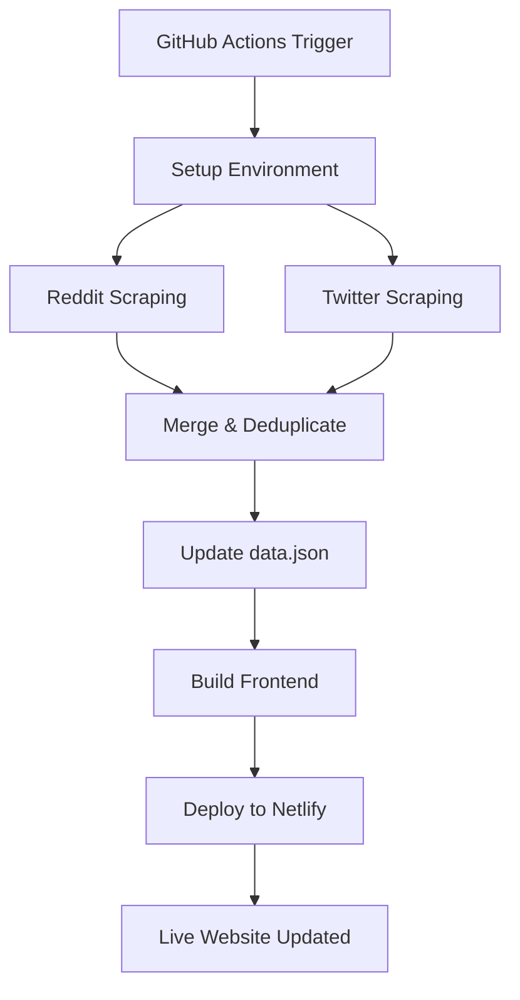

# 🤖 Automated Daily Prompt Scraping Setup

This guide will help you set up automated daily scraping of prompts from Reddit and Twitter for your Netlify-hosted webapp.

## 🏗️ Architecture Overview

```
┌─────────────────┐    ┌──────────────────┐    ┌─────────────────┐
│   GitHub Actions │───▶│   Scraping Script  │───▶│   Netlify Deploy │
│   (Daily 2 AM)   │    │   (Reddit+Twitter) │    │   (Auto-build)   │
└─────────────────┘    └──────────────────┘    └─────────────────┘
         │                        │                        │
         ▼                        ▼                        ▼
┌─────────────────┐    ┌──────────────────┐    ┌─────────────────┐
│  Environment    │    │   data.json      │    │   Live Website  │
│  Variables      │    │   (5000 prompts) │    │   (Updated Daily)│
└─────────────────┘    └──────────────────┘    └─────────────────┘
```

## 📋 Setup Steps

### 1. Repository Secrets Configuration

Add these secrets to your GitHub repository (`Settings` → `Secrets and Variables` → `Actions`):

#### Reddit API Secrets
- `REDDIT_CLIENT_ID`: Your Reddit app client ID  
- `REDDIT_CLIENT_SECRET`: Your Reddit app client secret

#### Twitter Scraping Secrets
- `BRIGHTDATA_API_KEY`: Premium residential proxy API key
- `SCRAPINGDOG_API_KEY`: Web scraping API key  
- `SCRAPECREATORS_API_KEY`: Twitter-focused scraping API key
- `TWITTERAPI_IO_KEY`: TwitterAPI.io API key
- `X_USERNAME`: Twitter/X username for Playwright automation
- `X_PASSWORD`: Twitter/X password for Playwright automation

#### Additional APIs
- `FIRECRAWL_API_KEY`: Firecrawl web scraping API key

#### Netlify Deployment Secrets
- `NETLIFY_AUTH_TOKEN`: Your Netlify personal access token
- `NETLIFY_SITE_ID`: Your Netlify site ID

### 2. API Keys Setup Guide

#### Reddit API (Free)
1. Go to [Reddit App Preferences](https://www.reddit.com/prefs/apps)
2. Click "Create App" or "Create Another App"
3. Choose "script" type
4. Note your `client_id` and `client_secret`

#### Twitter Scraping APIs

**BrightData (Premium)**
- Sign up at [BrightData](https://brightdata.com)
- Get residential proxy API key
- Best reliability for Twitter scraping

**ScrapingDog (Good)**
- Sign up at [ScrapingDog](https://scrapingdog.com)
- Get API key for web scraping
- Good balance of cost/performance

**ScrapeCreators (Twitter-focused)**
- Sign up at [ScrapeCreators](https://app.scrapecreators.com/)
- Specialized for Twitter/X scraping

**TwitterAPI.io (Free tier available)**
- Sign up at [TwitterAPI.io](https://twitterapi.io/)
- Free tier with 100k credits

#### Netlify Setup
1. Get your site ID from Netlify dashboard
2. Generate personal access token in Netlify user settings

### 3. Current Scraping Capabilities

#### Reddit Sources
- 20+ subreddits related to AI, prompts, ChatGPT
- Advanced search terms for prompt discovery
- Automatic deduplication
- Rate limiting and error handling

#### Twitter Sources (4-Tier System)
1. **BrightData**: Premium residential proxies (highest reliability)
2. **ScrapingDog**: Fast web scraping API (high reliability)  
3. **ScrapeCreators**: Twitter-focused scraping (specialized)
4. **Hybrid Curated**: Fallback system (guaranteed results)

### 4. Automation Schedule

- **Daily Execution**: 2:00 AM UTC (10 PM EST)
- **Manual Triggers**: Available via GitHub Actions UI
- **Source Selection**: Can choose Reddit, Twitter, or both

### 5. Data Flow



## 🚀 Features

### Automated Scraping
- ✅ Daily automated execution
- ✅ Multiple source integration
- ✅ Duplicate detection and removal
- ✅ Data validation and cleaning
- ✅ Error handling and recovery

### Smart Data Management
- ✅ Maximum 5,000 prompts (performance optimized)
- ✅ Chronological sorting (newest first)
- ✅ SEO-friendly slug generation
- ✅ Metadata tracking (sources, dates)

### Deployment Integration
- ✅ Automatic Netlify deployment
- ✅ Static site generation
- ✅ Sitemap generation
- ✅ Build optimization

### Monitoring & Reporting
- ✅ GitHub Actions summary reports
- ✅ Scraping statistics tracking
- ✅ Error logging and notifications
- ✅ Manual trigger capabilities

## 📊 Expected Results

### Daily Automation
- **Reddit**: 10-50 new prompts per day
- **Twitter**: 20-100 new prompts per day  
- **Total Growth**: 30-150 new prompts daily
- **Quality Control**: Automatic filtering and deduplication

### Performance Impact
- **Build Time**: 2-5 minutes
- **Data Size**: ~120KB (optimized JSON)
- **Load Time**: <2 seconds (static hosting)
- **Update Frequency**: Once daily, fully automated

## 🛠️ Manual Operations

### Run Specific Source
```bash
# Trigger workflow with specific sources
# Go to Actions → Daily Automated Prompt Scraping → Run workflow
# Select sources: "reddit" or "twitter" or "reddit,twitter"
```

### Local Testing
```bash
cd automated-version
npm install

# Set environment variables in backend/.env
cd backend
node ../scripts/automated-scraping.js
```

### Monitor Results
- Check GitHub Actions logs
- Verify data.json updates in repository
- Confirm Netlify deployment success
- Visit live website to see new prompts

## 🔧 Troubleshooting

### Common Issues
1. **API Rate Limits**: Scrapers include delays and retry logic
2. **Authentication Failures**: Check API keys in repository secrets
3. **Build Failures**: Verify Node.js version and dependencies
4. **Deployment Issues**: Confirm Netlify tokens and site ID

### Debug Steps
1. Check GitHub Actions logs for detailed error messages
2. Verify all required secrets are set
3. Test individual scrapers locally
4. Check API key validity and quotas

## 📈 Scaling Options

### Increase Frequency
- Change cron schedule to every 6 hours: `0 */6 * * *`
- Multiple runs per day for higher volume

### Add More Sources
- Extend scraping to other platforms
- Add manual curation workflows  
- Integrate user submissions

### Advanced Features
- Email notifications on completion
- Slack/Discord integration
- Analytics and performance tracking

---

**Your automated prompt scraping system is now ready! 🎉**

The system will automatically scrape, process, and deploy new prompts daily, keeping your webapp fresh with the latest AI prompts from across the web.